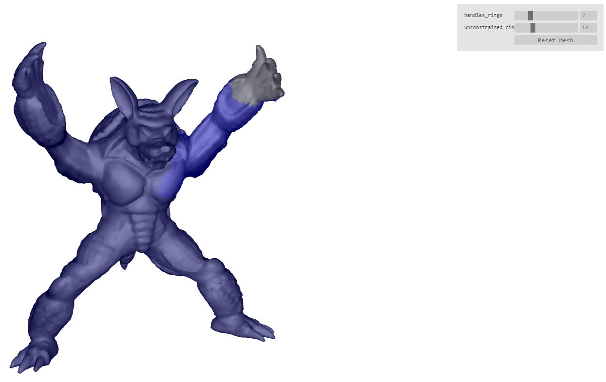

laplacian deformation module
=====================

[CLICK HERE FOR DEMO](https://mikolalysenko.github.io/laplacian-deformation/demo.html)

This module implements [laplacian surface editing](https://people.eecs.berkeley.edu/~jrs/meshpapers/SCOLARS.pdf).
This technique allows you to deform the surface of a mesh, while still preserving the details of the surface.
We implement this by minimizing the energy function (5) in the linked paper.

